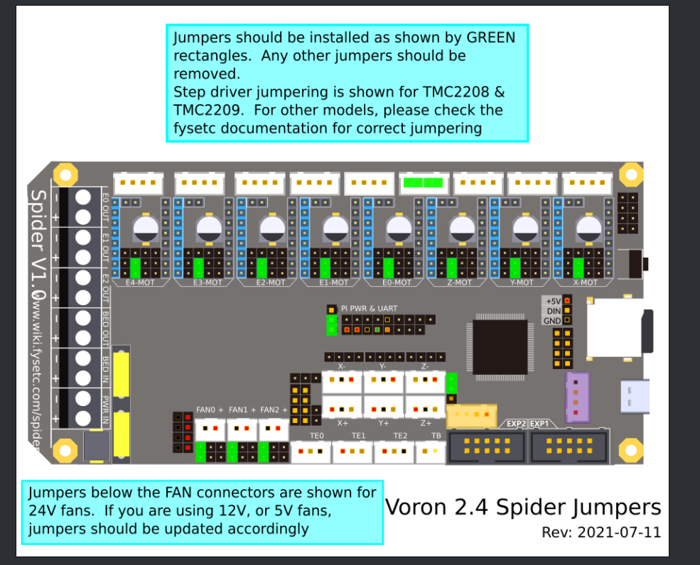

# Voron Trident

<!-- MarkdownTOC -->

- [Voron Afterburner PCB setup](#voron-afterburner-pcb-setup)
- [Fysetc Spider Wiring](#fysetc-spider-wiring)
- [Klipper Firmware](#klipper-firmware)
    - [Current Config](#current-config)
    - [Other Configs](#other-configs)
    - [Motor Configuration](#motor-configuration)
    - [Bed Heater Thermistor](#bed-heater-thermistor)
    - [Hotend Thermistor](#hotend-thermistor)
- [Initial Setup](#initial-setup)
    - [Motor Setup](#motor-setup)
    - [Configuring Limits](#configuring-limits)
    - [Inductive Probe](#inductive-probe)
    - [PID Tune](#pid-tune)
    - [Bed Levelling](#bed-levelling)
- [Z Offset Adjustment](#z-offset-adjustment)
- [Notes from Steve Build](#notes-from-steve-build)
- [Spider Setup](#spider-setup)
    - [WARNING](#warning)
    - [Flash Bootloader](#flash-bootloader)
    - [Install Klipper](#install-klipper)
    - [Compile Klipper for USB connectivity](#compile-klipper-for-usb-connectivity)
    - [Compile Klipper for GPIO connectivity](#compile-klipper-for-gpio-connectivity)
    - [Flash Firmware](#flash-firmware)
- [Neopixels](#neopixels)

<!-- /MarkdownTOC -->


# Voron Afterburner PCB setup
[up up up](#)

- [Crimping Microfits](https://www.youtube.com/watch?v=jM3Xfs3Nie4&t=66s)

correct way to insert crimp to microfit3:


**Pinout**

```
20/Red    24V  - HE0 +V
20/Black  GND  - PSU -V (NOT MAINS GND)
24/Red    PROBE/ABL  - Probe Signal Pin
20/Black  HE0  - Hotend Heater -V
24/Red    CT   - Chamber Thermistor Signal Pin (TH1)
24/Black  PCF  - Part Cooling Fan -V
24/Black  HEF  - Hotend Cooling Fan -V
24/Black  AGND - Hotend Thermistor -V
24/Red    TH0  - Hotend Thermistor Signal Pin (TH0)
24/Red    S1A  - Red Stepper Wire
24/Black  S2A  - Green Stepper Wire
24/Red    S1B  - Blue Stepper Wire
24/Black  S2B  - Black Stepper Wire
no        XES  - X Endstop Signal Pin
```

I did the wiring according to the following:


# Fysetc Spider Wiring
[up up up](#)

Read the following: [Voron V2 - Fysetc Spider Wiring](https://docs.vorondesign.com/build/electrical/v2_spider_wiring.html#voron-v2---fysetc-spider-wiring)

it referenced here that for the jumpers we need to do (do not put a jumper on the jst port):



you can also check [mhoush](https://github.com/VoronDesign/VoronUsers/tree/master/firmware_configurations/klipper/jaeger/Spider_1.1_V1.8) for wiring.

I connected the X/Y end stops as following:

* X endstop to X-
* Y endstop to Y-

Regarding how you cable the motors wires in a discussion with @jaeger (github id mhoush) he mentioned:

> The only reason for that is that's what color order MY stepper motors had Apparently there's no real standard for it. So with that said the colors aren't as important as the windings. If you're not sure or don't have data from the stepper manufacturer, you can identify windings by shorting two of the wires together (with the stepper unplugged) If it gets harder to turn by hand, those two wires are a winding (winding = πηνίο)

check [(LDO-42STH20-1004ASHVRN-RevA-technical-datasheet.pdf]((LDO-42STH20-1004ASHVRN-RevA-technical-datasheet.pdf) which states that fot he exrtruder motor we have the windings pairs are Black/A-Green/C and Red/B-Blue/D These are wired into the After Burner PCB:

| Type   | Winding 1  | Winding 1 | Winding 2 | Winding 2 |
| ----   | ---------- | --------- | ----------| --------- |
| Cable  | Black      | Green     | Red       | Blue      |
| PCB    | S1B        | S1A       | S2A       | S2B       |
| Spider | A2         | A1        | B1        | B2        |

Regarding the motor wiring I did:

* M1 - X-MOT - Z-LEFT
* M2 - Y-MOT  - A
* M3 - Z-MOT  - Empty
* M4 - E0-MOT  - E
* M5 - E1-MOT  - Z-RIGHT
* M6 - E2-MOT  - Z-REAR
* M7 - E3-MOT  - B
* M8 - E4-MOT  - Empty

# Klipper Firmware
[up up up](#)


## Current Config

**My current configuration is this [printer.cfg](printer.cfg)**

## Other Configs

* [sample_firmwares/trident-spider-1.1.majarspeed.cfg](sample_firmwares/trident-spider-1.1.majarspeed.cfg) from [github](https://github.com/VoronDesign/Voron-Trident/pull/31/files#diff-49b85b295ce263151f979881d4326cc7c3504857046146740b0433b2c8fc1a66)
* [sample_firmwares/trident-spider-1.1.mhoush.cfg](sample_firmwares/trident-spider-1.1.mhoush.cfg) from [github](https://github.com/mhoush/Voron-Trident/blob/main/Firmware/Voron_Trident_Spider_1.1.cfg)
* [sample_firmwares/trident-spider-1.1.nkalogerinis.cfg](sample_firmwares/trident-spider-1.1.nkalogerinis.cfg) from nick

start [here](https://docs.vorondesign.com/build/software/configuration.html)

## Motor Configuration

we currently have:

* X/Y: LDO-42STH40-2004MAC(VRN) [datasheet of hi temp equivalent](HT_LDO-42STH40-2004MAH_VRN_RevA-technical-datasheet.pdf) 0.9° Step Angle/400 Steps/2 Amp/350mN-m Holding Torque/130C 
* Ex1: LDO-42STH20-1004ASH-MM(VRN) [datasheet](LDO-42STH20-1004ASHVRN-RevA-technical-datasheet.pdf) 1.8° Step Angle/200 Steps/1.0A/18Ncm Holding Torque/180C
* Zx3: LDO-42STH40-1684L300E(VRN) [datasheet](LDO-42STH40-1684L300EVRN-RevA-technical-datasheet.pdf) 1.8° Step Angle/200 Steps/1.68A/450Nm Holding Torque/130C

calculate currents based on [Calculating Driver Current Settings ](https://docs.vorondesign.com/community/howto/120decibell/calculating_driver_current.html). And avoid specifying hold current because klipeer says [so](https://www.klipper3d.org/TMC_Drivers.html#prefer-to-not-specify-a-hold_current)


* X/Y: `run_current = 2 * 0.707 = 1.414`, `hold_current = run_current * 0.6 = 0.8484`
* Zx3: `run_current = 1.68 * 0.707 = 1.1877`, `hold_current = run_current * 0.6 = 0.712`
* Ex1: `run_current = 1 * 0.707 = 0.7`, `hold_current = run_current * 0.6 = 0.42`

Go with conservative configs, microsteps 32 and interpolation off. Do not setup hold_current. Mainly use the settings in octopus config. run currents are calculated based on 70% of the run_rurrent

```yaml
[stepper_x]
microsteps: 32
full_steps_per_rotation: 400  # 200 for 1.8 degree motors, 400 for 0.9 degree

[tmc2209 stepper_x]
uart_pin: PA15
interpolate: False
run_current: 1.0
sense_resistor: 0.110
stealthchop_threshold: 0

[stepper_y]
microsteps: 32
full_steps_per_rotation: 400  # 200 for 1.8 degree motors, 400 for 0.9 degree

[tmc2209 stepper_y]
uart_pin: PE15
interpolate: False
run_current: 1.0
sense_resistor: 0.110
stealthchop_threshold: 0
```

```yaml
[stepper_z1]
microsteps: 32

[tmc2209 stepper_z1]
uart_pin: PC15
interpolate: False
run_current: 0.7
sense_resistor: 0.110
stealthchop_threshold: 0
```

```yaml
[extruder]
microsteps: 32

[tmc2209 extruder]
uart_pin: PD7
interpolate: False
run_current: 0.5
sense_resistor: 0.110
stealthchop_threshold: 0
```

## Bed Heater Thermistor

Thermistor used in the Keenovo is a 'NTC 100K thermistor (Beta 25/50 3950K-1%)' based on the [fermio site](https://fermio.xyz/keenovo-international-group-limited/keenovo-silicone-heatmat-290-x-290mm-230-v-ac-400-w/)

from [klipper config](https://www.klipper3d.org/Config_Reference.html#extruder)

```
sensor_type:
#   Type of sensor - common thermistors are "EPCOS 100K B57560G104F",
#   "ATC Semitec 104GT-2", "ATC Semitec 104NT-4-R025H42G", "Generic
#   3950","Honeywell 100K 135-104LAG-J01", "NTC 100K MGB18-104F39050L32",
#   "SliceEngineering 450", and "TDK NTCG104LH104JT1". See the
#   "Temperature sensors" section for other sensors. This parameter
#   must be provided.
```

```yaml
sensor_type: Generic 3950
```

## Hotend Thermistor

got [(vonwange) ATC Semitec 104GT-2](https://vonwange.com/product/vonwange-atc-semitec-104gt-2/)

```yaml
[extruder]
sensor_type: ATC Semitec 104GT-2
```

# Initial Setup
[up up up](#)

* [Initial Startup Checks ](https://docs.vorondesign.com/build/startup/)
* [Configuration checks¶](https://www.klipper3d.org/Config_checks.html)

## Motor Setup

```console
STEPPER_BUZZ STEPPER=stepper_x
STEPPER_BUZZ STEPPER=stepper_y
STEPPER_BUZZ STEPPER=stepper_z
STEPPER_BUZZ STEPPER=stepper_z1
STEPPER_BUZZ STEPPER=stepper_z2
STEPPER_BUZZ STEPPER=extruder

QUERY_ENDSTOPS
```

check this try to do a home x and y and invert pins if required

```yaml
dir_pin: PD6
```


## Configuring Limits

```gcode
G90
G28 X Y
G1 X300.00 Y300.00 F7800
G1 X0.00 Y0.00 F7800
M114 # get current location
G1 X300.00 Y0.00 F7800
G1 X0.00 Y300.00 F7800
G90
G1 X170.00 Y300.00 F7800
```

Figure out where Z-Endstop is update [homing_override] or [safe_z_home] with those values. For me it is 170

## Inductive Probe

```
G28 X Y Z
QUERY_PROBE
# move bed close to nozzle
QUERY_PROBE
// probe: TRIGGERED
// PROBE_ACCURACY at X:150.000 Y:149.000 Z:35.000 (samples=10 retract=3.000 speed=5.0 lift_speed=5.0)
08:21:06  // probe at 150.000,149.000 is z=8.280000
08:21:08  // probe at 150.000,149.000 is z=8.281250
08:21:10  // probe at 150.000,149.000 is z=8.281250
08:21:11  // probe at 150.000,149.000 is z=8.281250
08:21:13  // probe at 150.000,149.000 is z=8.281250
08:21:15  // probe at 150.000,149.000 is z=8.281250
08:21:16  // probe at 150.000,149.000 is z=8.281250
08:21:18  // probe at 150.000,149.000 is z=8.281250
08:21:19  // probe at 150.000,149.000 is z=8.281250
08:21:21  // probe at 150.000,149.000 is z=8.281250
08:21:21  // probe accuracy results: maximum 8.281250, minimum 8.280000, range 0.001250, average 8.281125, median 8.281250, standard deviation 0.000375
```

## PID Tune

```
G28 X Y Z
G90
G1 Z7.00 F7800
PID_CALIBRATE HEATER=heater_bed TARGET=60
// PID parameters: pid_Kp=40.922 pid_Ki=1.057 pid_Kd=395.922

M106 S100
PID_CALIBRATE HEATER=extruder TARGET=210
// PID parameters: pid_Kp=25.246 pid_Ki=1.476 pid_Kd=107.925
```

## Bed Levelling

verify that the following are under the probe:

```yaml
points:
    30, 5
    150, 245
    270, 5
```

For this process **NEVER** have the part fan on

```
G28 X Y
G90
G1 X30.00 Y5.00 F7800
G1 X150.00 Y245.00 F7800
G1 X270.00 Y5.00 F7800

SET_HEATER_TEMPERATURE HEATER=extruder TARGET=210
SET_HEATER_TEMPERATURE HEATER=heater_bed TARGET=60

G28 X Y Z
G90
G1 Z10.00 F7800
# allow some time needed for the probe to stabilize ~ 5 min
# wait until standard deviation < 0.003
PROBE_ACCURACY
G1 Z10.00 F7800
Z_TILT_ADJUST
```

# Z Offset Adjustment

```
G28
BED_MESH_CLEAR
Z_ENDSTOP_CALIBRATE
TESTZ Z=-30.0
TESTZ Z=-2.0
TESTZ Z=-0.3
```

The Z offset can be adjusted during a print using the Tune menu on the display, and the printer configuration can be updated with this new value. Remember that higher values for the position_endstop means that the nozzle will be closer to the bed.


# Notes from Steve Build

* nozzle to probe is about 2-3mm. I got it to 4mm
* igus chains 18 links
* washer ground/bed
* x igus chain fixed end on the toolhead to be as horizontal as possible
* y igus chain fixed end on front on the accent piece to be as horizontal as possible
* end stop octapus for probe
* probe uses 24V
* 2209 use UART
* connected pi to spider over pins
    * power use 20AWG
    * tx/rx use 24AWG

# Spider Setup
[up up up](#)

## WARNING
[up up up](#)

Before putting the drivers follow [this procedure](https://github.com/FYSETC/FYSETC-SPIDER/blob/main/Spider%203.3v%20issue.md) and according to [this](https://discord.com/channels/460117602945990666/822468097637875712/896816322279768084)

1. Power off the motherboard completely (remove the wiring completely), and wait for the 24v, 5v and 3.3v LEDs to be completely off.
2. Connect a 100K resistor (or a cable) to the +/- pole of MAIN_PWR. **Wait 10 minutes and disconnect it**
3. Connect a 100K resistor (or a cable) to the +/- pole of VMOT. **Wait 10 minutes and disconnect it**
4. Wait for 5-10 minutes, plug in the driver, and perform firmware and other operations.

## Flash Bootloader
[up up up](#)

This is the [procedure](https://github.com/FYSETC/FYSETC-SPIDER/tree/main/bootloader). You really do not need to do this part. According to FYSETC every board that leaves the factory [has already a bootloader on](https://github.com/FYSETC/FYSETC-SPIDER#441-upload-the-firmwaresdcard). However since there have been two versions of bootloaders lets put the latest 32k one.

Power off board, remove SD Card, and

- place jumper on BT0 and 3.3V. (Between Z- endstop and E0 driver). **This is on the right of the PI PWR & UART in the middle of the board. Place one jumper horizontally**
- Connect Spider to Pi with USB cable with jumper in place. 
- Set U5V jumper closest to stepper driver modules to power Spider from the Pi USB (you can power it with 24V I preferred this way). **The U5V jumper left of the PI PWR & UART in the middle of the board**


on the pi type:

```console
$ apt-get install dfu-util
$ dfu-util --list

dfu-util 0.9

Copyright 2005-2009 Weston Schmidt, Harald Welte and OpenMoko Inc.
Copyright 2010-2016 Tormod Volden and Stefan Schmidt
This program is Free Software and has ABSOLUTELY NO WARRANTY
Please report bugs to http://sourceforge.net/p/dfu-util/tickets/

Found DFU: [0483:df11] ver=2200, devnum=3, cfg=1, intf=0, path="1-1.2", alt=3, name="@Device Feature/0xFFFF0000/01*004 e", serial="STM32FxSTM32"
Found DFU: [0483:df11] ver=2200, devnum=3, cfg=1, intf=0, path="1-1.2", alt=2, name="@OTP Memory /0x1FFF7800/01*512 e,01*016 e", serial="STM32FxSTM32"
Found DFU: [0483:df11] ver=2200, devnum=3, cfg=1, intf=0, path="1-1.2", alt=1, name="@Option Bytes  /0x1FFFC000/01*016 e", serial="STM32FxSTM32"
Found DFU: [0483:df11] ver=2200, devnum=3, cfg=1, intf=0, path="1-1.2", alt=0, name="@Internal Flash  /0x08000000/04*016Kg,01*064Kg,03*128Kg", serial="STM32FxSTM32"

$ wget https://github.com/FYSETC/FYSETC-SPIDER/raw/main/bootloader/Bootloader_FYSETC_SPIDER.hex

$ objcopy --input-target=ihex --output-target=binary Bootloader_FYSETC_SPIDER.hex Bootloader_FYSETC_SPIDER.bin && dfu-util -a 0 -s 0x08000000:mass-erase:force -D Bootloader_FYSETC_SPIDER.bin

Copyright 2005-2009 Weston Schmidt, Harald Welte and OpenMoko Inc.
Copyright 2010-2016 Tormod Volden and Stefan Schmidt
This program is Free Software and has ABSOLUTELY NO WARRANTY
Please report bugs to http://sourceforge.net/p/dfu-util/tickets/

dfu-util: Invalid DFU suffix signature
dfu-util: A valid DFU suffix will be required in a future dfu-util release!!!
Opening DFU capable USB device...
ID 0483:df11
Run-time device DFU version 011a
Claiming USB DFU Interface...
Setting Alternate Setting #0 ...
Determining device status: state = dfuERROR, status = 10
dfuERROR, clearing status
Determining device status: state = dfuIDLE, status = 0
dfuIDLE, continuing
DFU mode device DFU version 011a
Device returned transfer size 2048
DfuSe interface name: "Internal Flash  "
Performing mass erase, this can take a moment
Setting timeout to 35 seconds
Downloading to address = 0x08000000, size = 20260
Download	[=========================] 100%        20260 bytes
Download done.
File downloaded successfully
```

keep U5V on powering by USB (closest to stepper driver modules) do not power from 24V yet.

## Install Klipper
[up up up](#)

use [kiauh](https://github.com/th33xitus/kiauh)

install everything as pi
```bash
pi@thor ~$ cd /home/pi/kiauh
./kiauh.sh

install klipper
install moonraker 1 instance
install fluidd (install MJPG-Streamer)
```

## Compile Klipper for USB connectivity
[up up up](#)

```console
$ cd klipper
$ make menuconfig

enable extra low-level configuration options
Micro-controller Architecture `STMicroelectronics STM32`
Processor model `STM32F446`
Clock reference `12 MHz crystal`
Boot address 32k
Communication interface USB (on PA11/PA12)

make
```

copy `out/klipper.bin` to an sdcard as FAT32 and place it on the root directory with the name `firmware.bin`.

## Compile Klipper for GPIO connectivity
[up up up](#)

```console
$ cd klipper
$ make menuconfig

enable extra low-level configuration options
Micro-controller Architecture `STMicroelectronics STM32`
Processor model `STM32F446`
Bootloader offset (32KiB bootloader)
Clock reference `12 MHz crystal`
Communication interface (Serial (on USART1 PA10/PA9))

make
```

copy `out/klipper.bin` to an sdcard as FAT32 and place it on the root directory with the name `firmware.bin`.

```console
pi@thor ~$ sudo raspi-config
3 Interface Options    Configure connections to peripherals
P6 Serial Port Enable/disable shell messages on the serial connection
Would you like a login shell to be accessible over serial? <No>
Would you like the serial port hardware to be enabled? <Yes>

add at /boot/config.txt
dtoverlay=pi3-disable-bt

remove from /boot/cmdline.txt any instance of "console=serial0,115200" or "console=ttyAMA0,115200"
```

## Flash Firmware
[up up up](#)

make sure that you have shutdown everything. place the SDCARD on spider and connect pi via usb. Power on pi and let everything boot.

goto pi and type:

```console
$ ls -l /dev/serial/by-id/
total 0
lrwxrwxrwx 1 root root 13 Oct 10 17:45 usb-Klipper_stm32f446xx_1D0032000250563046353420-if00 -> ../../ttyACM0
```

edit the klipper printer.cfg and enter the following (from klipper config [repository](https://github.com/Klipper3d/klipper/blob/master/config/generic-fysetc-spider.cfg) ):

```yaml
# This file contains common pin mappings for the Fysetc Spider board.
# To use this config, the firmware should be compiled for the STM32F446.
# When calling "menuconfig", enable "extra low-level configuration setup"
# and select the "12MHz crystal" as clock reference.
# For flashing, write the compiled klipper.bin to memory location 0x08000000

# See docs/Config_Reference.md for a description of parameters.

[stepper_x]
step_pin: PE11
dir_pin: PE10
enable_pin: !PE9
microsteps: 16
rotation_distance: 40
endstop_pin: PB14  # PA1 for X-max
position_endstop: 0
position_max: 200

[stepper_y]
step_pin: PD8
dir_pin: PB12
enable_pin: !PD9
microsteps: 16
rotation_distance: 40
endstop_pin: ^PB13  # PA2 for Y-max
position_endstop: 0
position_max: 200

[stepper_z]
step_pin: PD14
dir_pin: PD13
enable_pin: !PD15
microsteps: 16
rotation_distance: 8
endstop_pin: PA0  # PA3 for Z-max
position_endstop: 0
position_max: 400

[extruder]
step_pin: PD5
dir_pin: !PD6
enable_pin: !PD4
microsteps: 16
rotation_distance: 33.500
nozzle_diameter: 0.400
filament_diameter: 1.750
heater_pin: PB15
sensor_type: EPCOS 100K B57560G104F
sensor_pin: PC0
control: pid
pid_Kp: 22
pid_Ki: 1.08
pid_Kd: 114
min_temp: 0
max_temp: 260

#[extruder1]
#step_pin: PE6
#dir_pin: !PC13
#enable_pin: !PE5
#heater_pin: PC8
#sensor_pin: PC1

#[extruder2]
#step_pin: PE2
#dir_pin: !PE4
#enable_pin: !PE3
#heater_pin: PB3
#sensor_pin: PC2

#[extruder3]
#step_pin: PD12
#dir_pin: PC4
#enable_pin: !PE8

#[extruder4]
#step_pin: PE1
#dir_pin: !PE0
#enable_pin: !PC5

[heater_bed]
heater_pin: PB4
sensor_type: EPCOS 100K B57560G104F
sensor_pin: PC3
control: watermark
min_temp: 0
max_temp: 130

#fan for printed model FAN0
[fan]
pin: PB0

#fan for hotend FAN1
#[heater_fan my_nozzle_fan]
#pin: PB1
#shutdown_speed: 1

#fan for control board FAN2
#[heater_fan my_control_fan]
#pin: PB2

#####################################################################
# LED Control
#####################################################################

#[output_pin caselight ]
##  Chamber Lighting - In 5V-RGB Position
#pin: PD3
#pwm: true
#shutdown_value: 0
#value:100
#cycle_time: 0.01

[mcu]
## Obtain definition by "ls -l /dev/serial/by-id/" then unplug to verify
serial: /dev/serial/by-id/usb-Klipper_Klipper_firmware_12345-if00

[printer]
kinematics: cartesian
max_velocity: 300
max_accel: 3000
max_z_velocity: 5
max_z_accel: 100

########################################
# TMC UART configuration
########################################

#[tmc2208 stepper_x]
#uart_pin: PE7
#run_current: 0.8
#hold_current: 0.5
#stealthchop_threshold: 999999

#[tmc2208 stepper_y]
#uart_pin: PE15
#run_current: 0.8
#hold_current: 0.5
#stealthchop_threshold: 999999

#[tmc2208 stepper_z]
#uart_pin: PD10
#run_current: 0.8
#hold_current: 0.5
#stealthchop_threshold: 999999

#[tmc2208 extruder]
#uart_pin: PD7
#run_current: 0.8
#hold_current: 0.5
#sense_resistor: 0.110
#stealthchop_threshold: 999999

#[tmc2208 extruder1]
#uart_pin: PC14
#run_current: 0.8
#hold_current: 0.5
#stealthchop_threshold: 999999

#[tmc2208 extruder2]
#uart_pin: PC15
#run_current: 0.8
#hold_current: 0.5
#stealthchop_threshold: 999999

#[tmc2208 extruder3]
#uart_pin: PA15
#run_current: 0.8
#hold_current: 0.5
#stealthchop_threshold: 999999

#[tmc2208 extruder4]
#uart_pin: PD11
#run_current: 0.8
#hold_current: 0.5
#stealthchop_threshold: 999999

########################################
# TMC SPI configuration
########################################

#[tmc2130 stepper_x]
#spi_bus: spi4
#cs_pin: PE7
#diag1_pin: PB14
#run_current: 0.800
#hold_current: 0.500
#stealthchop_threshold: 999999

#[tmc2130 stepper_y]
#spi_bus: spi4
#cs_pin: PE15
#diag1_pin: PB13
#run_current: 0.800
#hold_current: 0.500
#stealthchop_threshold: 999999

#[tmc2130 stepper_z]
#spi_bus: spi4
#cs_pin: PD10
#diag1_pin: PA0
#run_current: 0.800
#hold_current: 0.500
#stealthchop_threshold: 999999

#[tmc2130 extruder]
#spi_bus: spi4
#cs_pin: PD7
#diag1_pin: PA3
#run_current: 0.800
#hold_current: 0.500
#stealthchop_threshold: 999999

#[tmc2130 extruder1]
#spi_bus: spi4
#cs_pin: PC14
#diag1_pin: PA2
#run_current: 0.800
#hold_current: 0.500
#stealthchop_threshold: 999999

#[tmc2130 extruder2]
#spi_bus: spi4
#cs_pin: PC15
#diag1_pin: PA1
#run_current: 0.800
#hold_current: 0.500
#stealthchop_threshold: 999999

#[tmc2130 extruder3]
#spi_bus: spi4
#cs_pin: PA15
#run_current: 0.800
#hold_current: 0.500
#stealthchop_threshold: 999999

#[tmc2130 extruder4]
#spi_bus: spi4
#cs_pin: PD11
#run_current: 0.800
#hold_current: 0.500
#stealthchop_threshold: 999999

########################################
# EXP1 / EXP2 (display) pins
########################################

[board_pins]
aliases:
    # EXP2 header
    EXP1_10=<5V>, EXP1_9=<GND>,
    EXP1_8=PD1,   EXP1_7=PD0,
    EXP1_6=PC12,  EXP1_5=PC10,     # Slot in the socket on the other side
    EXP1_4=PD2,   EXP1_3=PC11,
    EXP1_2=PA8,   EXP1_1=PC9,

    # EXP1 header
    EXP2_10=<5V>, EXP2_9=<GND>,
    EXP2_8=<RST>, EXP2_7=PB10,
    EXP2_6=PA7,   EXP2_5=PC7,       # Slot in the socket on the other side
    EXP2_4=PA4,   EXP2_3=PC6,
    EXP2_2=PA5,   EXP2_1=PA6

# See the sample-lcd.cfg file for definitions of common LCD displays.
```

make sure you edit `[mcu]` part
type as root: `systemctl restart klipper`
go to the logs and verify that spider is detected:

```text
mcu 'mcu': Starting serial connect
Loaded MCU 'mcu' 91 commands (v0.10.0-39-g5f184e3f / gcc: (15:7-2018-q2-6) 7.3.1 20180622 (release) [ARM/embedded-7-branch revision 261907] binutils: (2.31.1-11+rpi1+11) 2.31.1)
MCU 'mcu' config: BUS_PINS_i2c1=PB6,PB7 BUS_PINS_i2c2=PB10,PB11 BUS_PINS_spi3a=PC11,PC12,PC10 BUS_PINS_spi2a=PC2,PC3,PB10 BUS_PINS_i2c1a=PB8,PB9 RESERVE_PINS_USB=PA11,PA12 CLOCK_FREQ=180000000 BUS_PINS_spi1a=PB4,PB5,PB3 STATS_SUMSQ_BASE=256 STEP_DELAY=2 ADC_MAX=4095 BUS_PINS_spi4=PE13,PE14,PE12 RESERVE_PINS_crystal=PH0,PH1 BUS_PINS_spi2=PB14,PB15,PB13 BUS_PINS_spi1=PA6,PA7,PA5 BUS_PINS_spi3=PB4,PB5,PB3 MCU=stm32f446xx
Sending MCU 'mcu' printer configuration...
Configured MCU 'mcu' (1024 moves)
Starting heater checks for heater_bed
Starting heater checks for extruder
...
```

shutdown everything, remove sdcard and verify that the `firmware.bin` is not there anymore.

when you  want to upgrade the firmware you will always do it with the sdcard.


# Neopixels

[yes!](https://discord.com/channels/460117602945990666/822468097637875712/932038192750792754)
